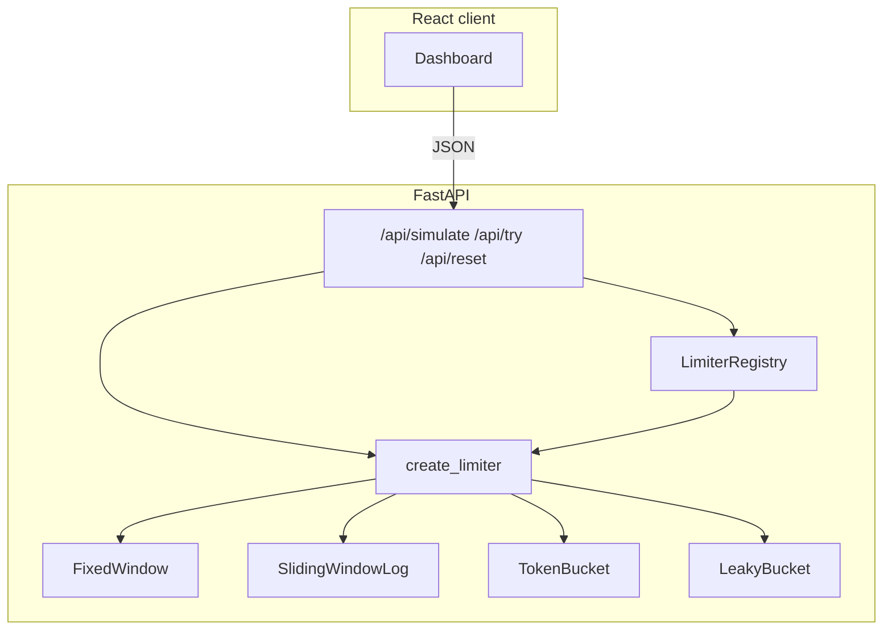

# Rate limiter showcase

Full-stack demo: a **FastAPI** (Python) API implements four classic rate-limiting algorithms as small, testable modules; **Vite + React** provides an interactive dashboard to simulate traffic and inspect allow/deny behavior.

## Requirements

- **Python 3.11+** (for the API)
- **Node.js 18+** (for the React client and root scripts)

## Quick start

From the repository root:

```bash
# Python API
cd api
python -m venv .venv
. .venv/bin/activate   # Windows: .venv\Scripts\activate
pip install -r requirements.txt
cd ..

# Client
npm install --prefix client

# Optional: root tooling (concurrently, prettier, eslint for client)
npm install
```

Start API and UI together:

```bash
npm run dev
```

- UI: [http://localhost:5173](http://localhost:5173) (proxies `/api` and `/health` to the API in dev)
- API: [http://localhost:3001](http://localhost:3001)

Run the API alone (from `api/` with venv active):

```bash
cd api
python main.py

# or:
python -m uvicorn main:app --reload --host 0.0.0.0 --port 3001
```

### Environment

| Variable                 | Default                         | Purpose |
|--------------------------|----------------------------------|---------|
| `PORT`                   | `3001`                           | API listen port (pass to uvicorn `--port` or set in hosting) |
| `CLIENT_ORIGIN`          | _(empty)_                        | Extra CORS origins (comma-separated). In non-production, `http://localhost:5173`, `http://127.0.0.1:5173`, and `http://[::1]:5173` are always allowed. |
| `ENVIRONMENT`            | `development`                    | Set to `production` to disable the built-in Vite dev origins for CORS. |
| `VITE_API_URL`           | _(empty in dev)_                 | Absolute API base for production static hosting. |
| `VITE_API_PROXY_TARGET`  | `http://127.0.0.1:3001`          | **Dev only:** Vite proxy target for `/api` and `/health`. |

**Why Postman can work while the UI shows offline:** Postman does not send a browser `Origin`. The UI uses the Vite proxy or `VITE_API_URL`; check proxy target, CORS, and server logs (`[cors]`, `[http]`).

## Algorithms

| Algorithm        | Implementation              | Behavior (short) |
|------------------|-----------------------------|------------------|
| Fixed window     | `FixedWindowLimiter`        | Aligned windows; count resets at each boundary. |
| Sliding window   | `SlidingWindowLogLimiter`   | Stores allowed timestamps; prunes older than the window. |
| Token bucket     | `TokenBucketLimiter`        | Refills at `refillPerSecond`; bursts up to `capacity`. |
| Leaky bucket     | `LeakyBucketLimiter`        | Leaks at `leakPerSecond`; rejects when the queue is full. |

Limiters accept explicit **virtual time** (`nowMs`) so `/api/simulate` can run deterministic replays.

## Architecture



- **`POST /api/simulate`** — New limiter per request; `requestCount` steps at `intervalMs` virtual spacing; returns `summary` + `results`.
- **`POST /api/try`** — Registry `get_or_create`; `nowMs` defaults to wall clock ms; **200** or **429**.
- **`POST /api/reset`** — `{ "removed": number }`.
- **`GET /health`** — `{ "status": "ok", "timestamp": "<ISO8601>" }`.

Validation uses **Pydantic**; validation errors respond with `{ "error": { "code": "VALIDATION_ERROR", "message": "...", "details": ... } }`.

State is **in-memory**. Production would use **Redis** (or similar) for shared counters.

## Scripts

| Command              | Description                          |
|----------------------|--------------------------------------|
| `npm run dev`        | Uvicorn (reload) + Vite              |
| `npm run build`      | Vite production build (client)       |
| `npm run test`       | `pytest` in `api/`                   |
| `npm run typecheck`  | TypeScript (`client`)                |
| `npm run lint`       | ESLint (`client`)                    |
| `npm run format`     | Prettier (repo)                      |

## Project layout

```
api/main.py           # FastAPI app + `python main.py` entrypoint (run from `api/`)
api/app/limiters/     # Algorithm implementations
api/app/services/     # Factory + registry
api/app/routers/      # HTTP routes
api/tests/            # pytest (limiters + HTTP)
client/src/           # React UI + API helpers
```

## License

MIT
